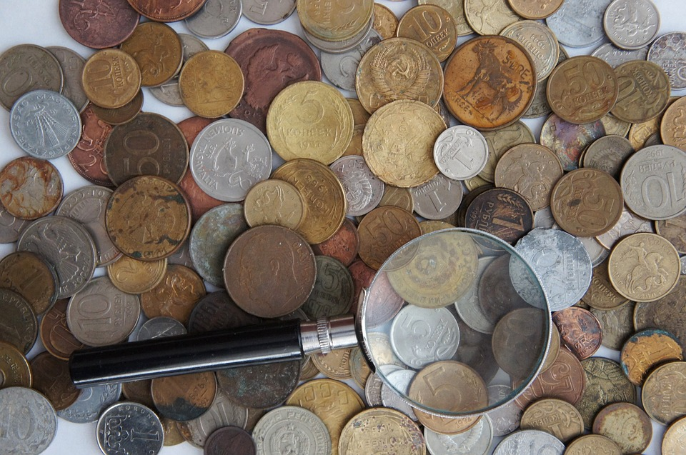

# Change Detection

Change Detection เป็นกระบวนการที่ Angular ทำการ sync กันระหว่างส่วนของ view และ model

หากใครมีประสบการณ์กับ **Angular 1** คงจะเคยเจ็บปวดกันมาบ้างกับ**การทำ Two way binding มากเกินไป** ซึ่งทำให้เกิดสร้าง watcher มากเกินความจำเป็น ทำให้ **เพิ่มภาระในการทำ dirty checking ของ digest loop ซึ่งส่งผลเรื่องของ Performance** รวมทั้ง Concept ของ Two way binding มี flow ของการเปลี่ยนแปลงข้อมูลค่อนข้างปวดหัว คือ View และ Model สามารถเปลี่ยนแปลงค่าของกันและกันได้หมดเลย 

ซึ่งใน **Angular 2** ความเจ็บปวดเหล่านี้จะหายไปเพราะเราเปลี่ยนมาใช้ concept ของ **unidirectional data-flow** (ถึงแม้จะใช้ `ngModel` ทำ two way binding ก็ไม่ต้องกังวลเรื่อง performance) ซึ่งโค้ดของเรามีหน้าที่ทำการอัพเดตข้อมูลในส่วนของ models และ angular จะทำหน้าที่ render ส่วนของ views เมื่อมีการเปลี่ยนแปลงเกิดขึ้นตาม Change Detection Strategy ที่กำหนดไว้
