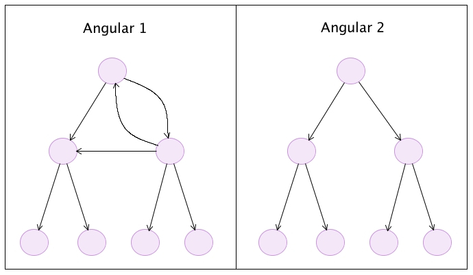

# Change Detection Strategies in Angular 1 vs Angular 2

สิ่งที่แตกต่างกันวิธีที่ node (Directive/Component) เช็คว่า Element (DOM) ต้องทำการ update

เนื่องด้วยที่ว่าธรรมชาติของ two-way binding ใน angular 1 
- parent node ไม่จำเป็นต้องถูกเช็คก่อน child node
- child node สามารถเปลี่ยนแปลง parent, sibling หรือ node ใดก็ได้ใน tree ซึ่งทำให้เกิดการอัพเดทลงไปทั้งสายของ node 
ปัญหาเหล่านี้ทำให้เกิดความยุ่งยาก เมื่อหาก change detection ต้องทำงานโดยไล่ไปตาม node ต่างๆ โดยไม่ให้เกิด error ที่คุ้นเคยว่า

```
10 $digest() iterations reached. Aborting!
```

พอกันที! 
ใน Angular 2 การเปลี่ยนแปลงทุกครั้ง จะเริ่มทำการ check จาก root ไล่ลงไปตามสายของ node โดยจะทำการเช็คแค่ 1 ครั้งต่อ 1 node เท่านั้น ซึ่งหมายความว่า parent component จะถูกเช็คก่อน children เสมอ

_เปรียบเทียบการ check update ของ Angular 1 และ Angular 2_


