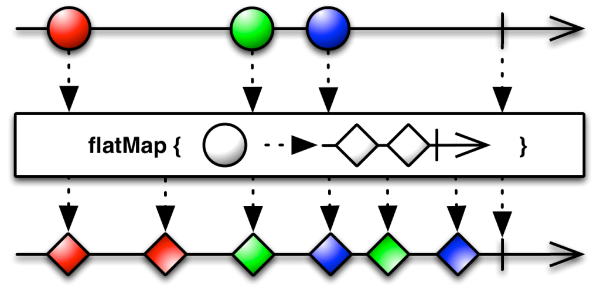

# Observables Array Operations
In addition to simply iterating over an asynchronous collection, we can perform other operations such as filter or map and many more as defined in the RxJS API. This is what bridges observable with the Iterable pattern, and lets us conceptualize them as collections.

Let's expand our example and do something a little more with our stream:

```js
import {Component} from 'angular2/core';
import {Http, Headers} from 'angular2/http';
import 'rxjs/Rx';

@Component({
	selector: 'app-root',
	template: `
	  <b>Angular 2 HTTP requests using RxJs Observables!</b>
	  
	  <div><code>{{doctors.toString()}}</code></div>
	  `
})

export class AppComponent {
  private doctors = [];
  
  constructor(http: Http) {
    http.get('http://jsonplaceholder.typicode.com/users/')
        .flatMap((data) => data.json())
        .filter((person) => person.id > 5)
        .map((person) => "Dr. " + person.name)
        .subscribe((data) => {
          this.doctors.push(data);
        });
  }
}
```
[View Example](http://plnkr.co/edit/d3pigxK1JhfAeVMihGGq?p=preview)

Here are two really useful array operations - `map` and `filter`. What exactly do these do?

`map` will create a new array with the results of calling a provided function on every element in this array. In this example we have used it to create a new result set by iterating through each item and appending the "Dr." abbreviation in front of every users name. Now every object in our array has "Dr." prepended to whatever the value is of its name property. 

`filter` will create a new array with all elements that pass the test implemented by a provided function. Here we have used it to create a new result set by excluding any user whose `id` property is less than 6. 

Now when our `subscribe` callback gets invoked, the data it receives will be a list of JSON objects with every item's `age` property greater or equal to 18. 

Note the chaining function style, and the optional static typing that comes with TypeScript we have used in this example. Most Importantly functions like filter return an observable, as in observables beget other observables, similarly to promises. In order to use `map` and `filter` in a chaining sequence we have flattened the results of our Observable using `flatMap`. Since `filter` accepts an Observable, and not an array, we have to convert our array of JSON objects from `data.json()` to an Observable stream. This is done with `flatMap`.

There are many other array operations you can employ in your Observables, look for them in the [RxJS API](https://github.com/Reactive-Extensions/RxJS). 

## Combining Streams with `flatMap`



Lets say we wanted to implement an AJAX search feature in which every keypress in a text field by the user will automatically perform a search and update the page with the results. How would this look? Well we would have an Observable subscribed to events coming from an input field, and on every change of input we want to perform a some http request, which is also an Observable we subscribe to. What we end up with is an Observable of an Observable. 

By using `flatMap` we can transform our event stream (the keypress events on the text field) into our response stream (the search results from the http request). 

*app/services/Search.ts* 

```ts
import {Http} from 'angular2/http';
import {Injectable} from 'angular2/core';

@Injectable()
export class SearchService {
  
  constructor(private http: Http) {}
  
  search(term: string) {
    return this.http
    		.get('https://api.spotify.com/v1/search?q=' + term + '&type=artist')
    		.map((response) => response.json())
  }
}
```
Here we have a basic service that will undergo a search query to Spotify by performing a get request with a supplied search term. This `search` function returns an Observable that has had some basic post-processing done (turning the response into a JSON object). 

OK, lets take a look at the Component that will be using this service. 

*app/app.ts*

```js
import {Component} from 'angular2/core';
import {Control, ControlGroup, FormBuilder} from 'angular2/common';
import {SearchService} from './services/Search';
import 'rxjs/Rx';

@Component({
	selector: 'app-root',
	template: `
		<form [ngFormModel]="coolForm"><input ngControl="search" placeholder="Search Spotify artist"></form>
		
		<div *ngFor="#artist of result">
		  {{artist.name}}
		</div>
	`
})

export class AppComponent {
	searchField:Control;
	coolForm:ControlGroup;
	
	constructor(private searchService:SearchService, private fb:FormBuilder) {
		this.searchField = new Control();
		this.coolForm = fb.group({search: this.searchField});
		
		this.searchField.valueChanges
						.debounceTime(400)
						.flatMap(term => this.searchService.search(term))
						.subscribe((result) => {
						  this.result = result.artists.items
						});
	}
}
```
[View Example](http://plnkr.co/edit/OdggjhnwjQLSwhYAjg8H?p=preview)

Here we have setup a basic form with a single field - `searchField`, which we subscribe to for event changes. We've also setup a simple binding for any results coming from the SearchService. The real magic here is `flatMap` which allows us to flatten our two separate subscribed Observables into a single cohesive stream we can use to control events coming from user input and from server responses. 

Note that flatMap flattens a stream of observables (i.e observable of observables) to a stream of emitted values (a simple observable), by emitting on the "trunk" stream everything that will be emitted on "branch" streams.

